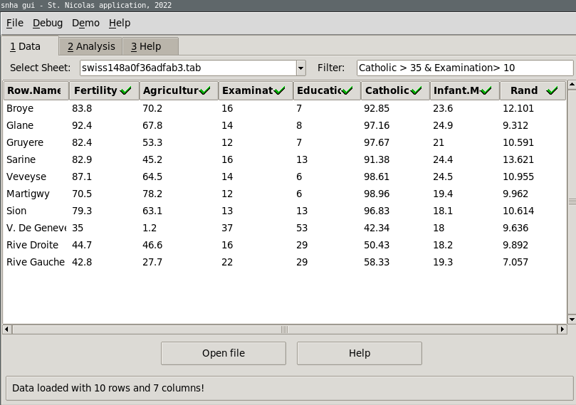
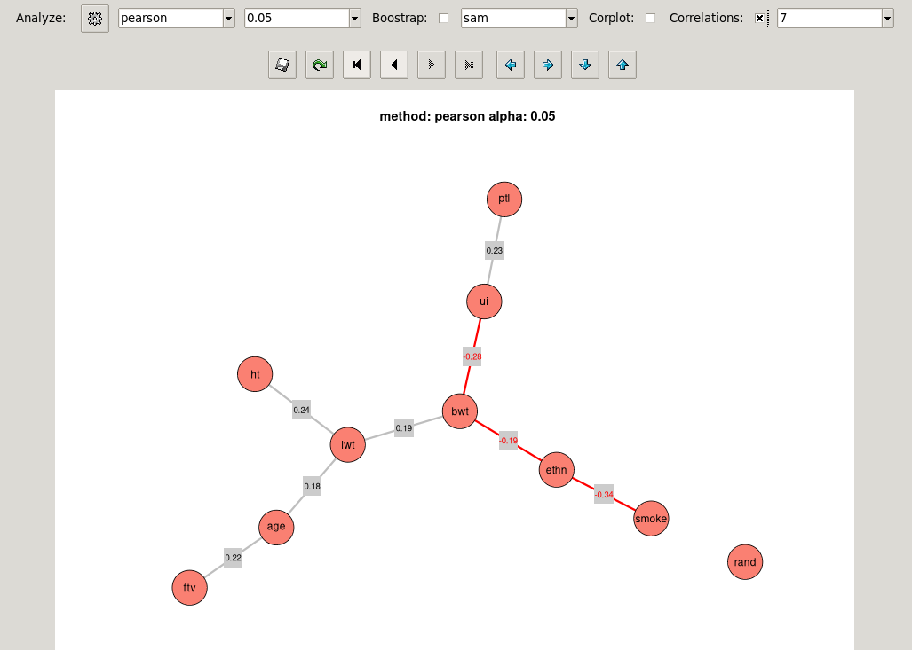

## <a name="toc">Table of Contents</a>

  * [Table of Contents](#toc)
  * [Introduction](#intro)  
  * [Data Preparation](#dataprep)
  * [Data Selection](#datasel)
  * [Analysis](#analysis)
  * [Analysis Export](#export)
  * [Demo Data](#demo)
  * [Summary](#summary)
  * [Changes](#changes)
  * [Packages](#packages)  
  * [TODO](#todo)  
  * [License](#license)
  
-----

## <a name="intro">Introduction</a>

The application provides a graphical user interface for the St. Nicolas House
Analysis (SNHA) Algorithm. The algorithm essentially identifies variables
where the correlations between them are decreasing in the same way for
forward and reverse ordered variables. For example assume we have the
variables *A*, *B* and *C*, if the forward ordering *r(A,B)* > *r(A,C)* and
in the reverse *r(C,B)* > *r(C,A)* then we have an association chain.

For a detailed background on the algorithm, please refer to the following two
papers:

- Groth, D., Scheffler, C., & Hermanussen, M. (2019). Body height in
  stunted Indonesian children depends directly on parental education and
  not via a nutrition mediated pathway-Evidence from tracing association
  chains by St. Nicolas House Analysis. Anthr Anz, 76(5), 445-451.

- Hermanussen, M., Aßmann, C., & Groth, D. (2021). Chain Reversion for
  Detecting Associations in Interacting Variables - St. Nicolas House
  Analysis. Int J Env Res Pub Health, 18(4), 1741.

There exists a R package for the algorithm "snha" which was relased to the
CRAN repository. To install the package just write the following line into
your R-console:

     install.packages("snha")
     
In case your would like to install the latest package version directly from
the project page, please refer to https://github.com/mittelmark/snha

For researchers who are not R developers, the graphical user interface
provided with this application offers an alternative way to create networks
of interacting variables using a standard open-and-click interface.

The application's workflow consists actually of the following steps:

  - Prepare your data in an Excel or Tab file.
  - Open an Excel or Tab file containing the data.
  - Select the appropriate columns for analysis.
  - Please note that all column names will be abbreviated to the first five letters of the column names to allow correct display in the graph.
  - Perform the analysis using standard settings (usually Pearson correlation, p- value threshold of 0.05 or 0.1)
  - Export the analysis to an Excel file.

The following sections we will describe the analysis.

-----

## <a name="datapre">Data Preparation</a>

You could start by looking at the demo data. This will help you prepare for
analyze your own data. To see how to work with the demo data, take a look at
the [Demo Data](#demo) section.

The application can process Excel data in the *xlsx* format and tabulated
files where the columns are separated by tab stops and the first row contains
the column headers. In Excel files all tab sheets can be used to import data.
Please use short column names which should be placed in the first row. Column
names should not contain special symbols or spaces. Remove any formatting
from the files if you encounter any problems. For display in the network
visualization only the first five letters and numbers of the column names will
be used. Column names should not start with numbers.

-----

## <a name="datasel">Data Selection</a>

You can load the Excel or Tab files using the "File Open" button or the
"File > Open File" menu option. The first 200 lines will be then displayed in
the table widget. You can then select and deselect columns by clicking on the
column header. Visual indicators in the column headers will confirm if a
column is selected (green checkmark) or deselected (red cross symbol). After
selecting the columns, you can process the data by switching to the
*Analysis* tab.

To the right of the "Select Sheet" combo box is a "Filter" entry field where
you can add logical expressions using the syntax "colname > value". Supported
operators include greater than (>), smaller (<), equality (== ) and inequality (!=).
You can combine several expressions with the ampersand sign ("&") for the AND
operator and the pipe sign ("|") for the OR operator. Here an example for the
swiss data set.

"Fertility > 70 & Examination < 20" for example, would only show and use data
with fertility values greater than 70 and examination values smaller than 20.
These logical expressions can be used as for qualitative data like sex where
we there are usually only two values in the data.

-----

## <a name="analysis">Analysis</a>

Next, switch to the *Analysis* tab of the application. Use the default
settings: here *Pearson* correlation and a p-value threshold of 0.05. Then,
press the Analyze button at the left. Your analysis is shown in the image
widget below. Please note that even if the image quality appears poor on some
systems, you can create high-quality graphics in PDF-format by exporting the
image using the Save button at the top.

Feel free to experiment with the analysis options, all graphs will be saved.
However, the settings "Pearson" or "Spearman" and a p-value threshold of 0.05
are usually recommended. If you would like to change the layout, just press
the tool button on the left. There are also different layout options, such as:

  * 'sam'    - non-metric MDS on the graph data, i.e. on the adjacency matrix, 
  * 'samd'   - non metric MDS on the data itself,
  * 'mds'    - metric MDS on the graph data,
  * 'mdsd'   - metric MDS on the data itself,  
  * 'circle' - circular layout
  
Additional layout options, such as Fruchterman-Reingold or star layout may be
added in the future. You can adjust the size of the plot image using the
arrow buttons above of the image. Please note that if you select the
Kendall-Tau method to calculate the correlations R will attempt to install a
fast implementation of this algorithm using the *pcaPP* package. To show the
correlations between connected nodes, check the "Correlations" box on the right.

There is also a bootstrap checkbox that enables resampling with replacement.
Stable edges should be found in most of the resamplings. The line type
indicates how often an edge was found: dotted lines indicate edges which were
found in 25-50% of resamplings, broken lines indicate edges which were found
in 50-75% of resamplings, and solid lines indicate edges found in more than
75% of resamplings. In empirical investigations, we have observed that random
data usually produce edges that appear in fewer than 10% of resamplings (T.
Hake 2022, personal communication). THerefore, we can consider edges that
appear in more than 25% of resamplings as significant.

There is a checkbox if you want to select nodes that are not to in
association chains for significant pairwise correlations (single-check). 

Further visualizations are available for pairwise correlations (Cor):

  * MDScor1 using correlation distance with formula *d(a,b) = 1-abs(r(a,b))* where highly negatively correlated variables have a low distance, they are displayed closely to each other 
  * MDScor2 using MDS using correlation distance with formula *d(a,b) = (1-r(r,ab))/2* where negatively correlated variables are far apart from each other
  * PCAvar PCA scores for the variables (PCAvar) 
  * PCAsam PCA scores for the samples (PCAsam) 
  * Clustering analysis using correlation distance as *d(a,b) = 1 - abs (r(a,b))*.

For the SNHA plots it is also possible to change the coloring. For example,
you can change the default salmon color to sky blue. Alternatively, you could
use use the harmonic centrality measure to display highly centralized nodes
in red, and unconnected or marginal nodes in light blue. A value of 1 for the
harmonic centrality would mean that the node is directly connected to all
other nodes in the graph, so all shortest paths for this node are 1. In
contrast, a value of zero means that the node is not connected to any other
node. For more information on the harmonic mean, see this blog post by
symbio5.nl:

https://symbio6.nl/en/blog/analysis/harmonic-centrality

In short, if you don't have time to read that page: A normalized harmonic
mean is the average inverse of all shortest path lengths from a specific node
to all other nodes. A value of 1 means that the node is connected to all
other nodes directly. A value of zero means that the node is not connected to
any other node. Here an example graph:
 

             B --- A --- C

So the values for **A** is: (1/1 + 1/1) / 2 = 1 (both paths have length 1)

The  value for **B** and **C** is: (1/1 + 1/2) / 2 = 0.75 (we have two paths of length 1 and 2)

So the formula is: *h = sum(s_i)/N-1*

where:

  * *hi:* is the harmonic mean of node *i*
  * *si*: is the vector of all shortest paths to all other nodes for node *i*
  * *N*:  is the number of nodes
  
**Hint:**  
You can export all the plots by  clicking on the "Save" button on the
left of the button bar. All plots will then be saved in a PDF file. 

-----

## <a name="export">Analysis Export</a>

You can save the analysis, which includes information about the graph and data,
some PCA analysis results, as well as the node centrality values, using the 
"File > Save Report" menu entry. The resulting Excel file contains the following
sheets:

  * "Adjacency matrix" - which node/variable is connect with which, an entry of 1 means they are connecred
  * "Cor pearson/spearman" - the correlation values for all variable pairs
  * "Cor p-values" - the correlation p-values for all variable pairs
  * "Chains" - the found St. Nicolas chains forming the final graph
  * "Settings" - the used settings to perform the analysis
  * "Data" - the input data for the algorithm  
  * "Centrality" - the degree and harmonic centrality values for all nodes
  * "Cor Plots" - the pairwise correlation plot
  * "Asg Plot" - the graph plot based on the association matrix
  * "Harmonic Plot" - the graph plot based on the  association  matrix  with color codes related to the harmonic centrality
  * "PCAPlot*" - plot of the PCA for the scaled variables
  * "PCAImportance" - the importance values for the PC's
  * "PCARotation" - the contributions of the variables to the new components
  * "PCAData" - the scaled data used for the PCA, NA's where imputed using the median before

-----

## <a name="demo">Demo Data</a>

You can load demo data by selecting the *Demo* menu option. 
Currently, there are the following data sets available:

  * The *swiss* dataset contains standardized fertility measures and socio-economic indicators for each of 47 French-speaking provinces of Switzerland at about 1888.
  * The dataset *birthwt* from the MASS library has 189 birth data samples and 10 variables. The data were collected at Baystate Medical Center, Springfield, Mass during 1986.
  * the dataset *environmental* from the lattice package contains daily measurements of ozone concentration, wind speed, temperature and solar radiation in New York City from May to September of 1973.
  * the *Boston* dataset from the MASS library with 506 rows and 14 columns.
  * the dataset *NHANES* from the NHANES library with 7,832 rows and 25 columns. These are survey data collected by the US National Center for Health Statistics ( NCHS) between 1999 and 2002. Installation of the NHANES data library is required. You will prompted to install it the first time you request the data.

The *swiss* and the *birthwt* datasets will have a last column called *Rand*
which just contains random data.

Load one of the datasets using the menu point below the *Demo* menu entry.

You can select and deselect the columns by clicking on the column. On the top
there is an indicator either a checkmark or a cross, to indicate if the column
is currently selected. You should with the demo column leave all columns checked.

Next, switch to the *Analysis* tab of the application. Use the default
settings here *Pearson* correlation and a p-value threshold of 0.05. Then,
press the Analyze button on the left. Your analyis is shown on the image
widget below of the button bars. Please note that even if the image quality
appears low, by exporting the image using the Save button at the top you can
create high quality graphics.

Feel free to experiment with the analysis options, all graphs will be saved.
However, the settings "Pearson" and a p-value threshold of 0.05 are usually
recommended.

Finally, to export an analysis, use the menu point *File > Save Report* and save
the analysis as an Excel file.

Here are the column descriptions:

**birthwt:**

  * age - mother's age in years
  * lwt - mother's weight in pounds at last menstrual period
  * race - renamed to ethn mother status, 1 = white, 2 = black, 3 = other
  * smoke - smoking status during pregnancy, 0 = no, 1 = yes
  * ptl - number of previous premature labours
  * ht - history of hypertension, 0 = no, 1 = yes
  * ui - presence of uterine irritability, 0 = no, 1 = yes
  * ftv - number of physician visits during the first trimester
  * bwt - birth weight of the child in grams

**Boston:**

  * crim - per capita crime rate by town
  * zn - proportion of residential land zoned for lots over 25,000 sq.ft
  * indus - proportion of non-retail business acres per town
  * chas - Charles River dummy variable (= 1 if tract bounds river; 0 otherwise).
  * nox - nitrogen oxides concentration (parts per 10 million)
  * rm - average number of rooms per dwelling
  * age - proportion of owner-occupied units built prior to 1940
  * dis - weighted mean of distances to five Boston employment centres
  * rad -  index of accessibility to radial highways
  * tax - full-value property-tax rate per 10,000
  * ptratio -  pupil-teacher ratio by town
  * black - 1000(Bk - 0.63)^2 where Bk is the proportion of blacks by town
  * lstat - lower status of the population (percent)
  * medv - median value of owner-occupied homes in 1000s

**environmental:**

  * ozone - average ozone concentration (of hourly measurements) of in parts per billion
  * radiation - solar radiation (from 08:00 to 12:00) in langleys
  * temperature - maximum daily emperature in degrees Fahrenheit
  * wind - average wind speed (at 07:00 and 10:00) in miles per hour

**swiss:**

  * Fertility - common standardized fertility measure
  * Agriculture - percent of males involved in agriculture as occupation 
  * Examination - percent of draftees receiving highest mark on army examination 
  * Education  -  percent of education beyond primary school for draftees
  * Catholic   - percent of catholic
  * Infant.Mortality - live births who live less than one year 

**NHANES:**

These are resampling data from 2009-2012, please see the package documentaion
to find out what all the variables are standing for. Not all variables are
used as demo data. Here is one online link to read the documentation and to
find more about the variable names:

https://cran.r-project.org/web/packages/NHANES/NHANES.pdf
  
-----

## <a name="summary">Summary</a>

The application provides major facilities for applying the St. Nicolas House
Analysis (SNHA) algorithm to your data, as well as for storing the analysis
and major graphics on your system. If you use the application please cite the
URL at github -  https://github.com/mittelmark/snha-gui and the following two 
papers:

  * Groth, D., Scheffler, C., & Hermanussen, M. (2019). Body height in stunted Indonesian children depends directly on parental education and not via a nutrition mediated pathway-Evidence from tracing association chains by St. Nicolas House Analysis. Anthr Anz, 76(5), 445-451.
  * Hermanussen, M., Aßmann, C., & Groth, D. (2021). Chain Reversion for Detecting Associations in Interacting Variables - St. Nicolas House Analysis. Int J Env Res Pub Health, 18(4), 1741.

-----

## <a name="changes">Changes</a>

**Version 0.3:**

  * load recent file
  * adding correlation plot in plot area
  * adding save images as png directly

**Version 0.4:**

  * adding nhanes.tab as demo 
  * building standalone Rscripts  

**Version 0.5.0:**

  * adding installation of NHANES and pcaPP (for cor.fk) libraries

**Version 0.5.1:**

  * fix for  wrong column names
  * adding correlation values is possible to plot
  * selecting layout sam, samd (sammon on data), mds, mdsd (MDS on data) and circle

**Version 0.6.0 - Summerschool 2022:**

  * more example datasets Boston (library MASS), environmental (library lattice)
  * size of node text and in correlation plot is now adjustable
  * single check for isolated nodes is now available
  * more plotting methods for PCA (of variables and samples) and for clustering

**Version 0.7.0 - Aschauhof Autumn 2022:**

  * adding data filtering
  * two MDS distances can be used
  * correlation values can be shown on the graph
    
**Version 0.7.1 - October 2022**

  * adding csv loading support
  * adding PCA imputation

**Version 0.8.0 - January, 7th 2026**
  
  * adding support for harmonic centrality in node coloring
  * fixing Excel report saving
  * redesign of project and new Github project at https://github.com/mittelmark/asg for GUI and package
    
**Version 0.8.1 - January, 9th 2026**

  * automatic removal of variables with zero variance in the analysis

**Version 0.8.2 - January, 12th 2026**

  * documentation fixes
  * bootstrap number can be selected between 0 and 500
  * bootstrap value added to report settings tab

-----

## <a name="packages">Packages</a>

  * base64 - Jeroen Ooms (2016). base64: Base64 Encoder and Decoder. R package version 2.0. 
    https://CRAN.R-project.org/package=base64
  * NHANES - Randall Pruim (2015). NHANES: Data from the US National Health and Nutrition Examination Study. R package version 2.1.0.
    https://CRAN.R-project.org/package=NHANES
  * openxlsx - Philipp Schauberger and Alexander Walker (2021). openxlsx: Read, Write and Edit xlsx Files. R package version 4.2.4.
    https://CRAN.R-project.org/package=openxlsx
  * pcaPP -  Peter Filzmoser, Heinrich Fritz and Klaudius Kalcher (2021). pcaPP: Robust PCA by Projection Pursuit. R package version 1.9-74.
    https://CRAN.R-project.org/package=pcaPP
    
-----

## <a name="todo">TODO</a>

  * rs - threshold for r-square value
  * bootstrap - edge probabilities (done)
  * layout circle, sam, star (with most connected node in the center, partially done)
  * edit window to do data selection age >= 20 & age <= 30 (done)
  * pdf/png plot with settings at the margin spearman, p-val < 0.05 etc. (done)
  
-----

## <a name="license">License</a>

Copyright 2021-2026, Dr. Detlef Groth, University of Potsdam

Permission is hereby  granted, free of charge, to any person  obtaining a copy
of this software and associated  documentation files (the "Software"), to deal
in the Software without  restriction,  including without limitation the rights
to use, copy, modify,  merge,  publish,  distribute,  sublicense,  and/or sell
copies  of the  Software,  and to  permit  persons  to whom  the  Software  is
furnished to do so, subject to the following conditions:

The above copyright notice and this permission notice shall be included in all
copies or substantial portions of the Software.

THE  SOFTWARE IS PROVIDED  "AS IS", WITHOUT  WARRANTY OF ANY KIND,  EXPRESS OR
IMPLIED,  INCLUDING  BUT NOT  LIMITED TO THE  WARRANTIES  OF  MERCHANTABILITY,
FITNESS FOR A PARTICULAR  PURPOSE AND  NONINFRINGEMENT.  IN NO EVENT SHALL THE
AUTHORS  OR  COPYRIGHT  HOLDERS  BE LIABLE  FOR ANY  CLAIM,  DAMAGES  OR OTHER
LIABILITY,  WHETHER IN AN ACTION OF CONTRACT, TORT OR OTHERWISE, ARISING FROM,
OUT OF OR IN CONNECTION  WITH THE SOFTWARE OR THE USE OR OTHER DEALINGS IN THE
SOFTWARE.
  

